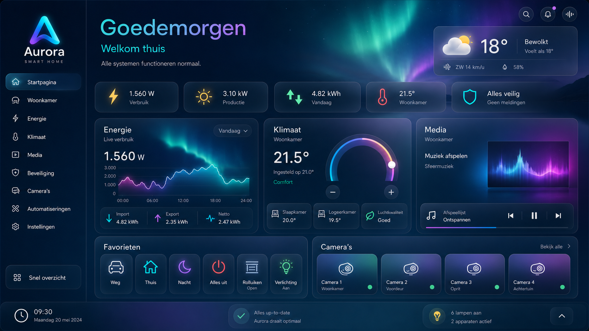

# Aurora Smart Home Dashboard v1.1.0-rc.1

> **Aurora is ontwikkeld met de filosofie dat een smart-home-dashboard niet alleen functioneel moet zijn, maar ook rust, overzicht en plezier moet brengen in het dagelijks gebruik.**

> **Transparantie:** Aurora is ontwikkeld door de maintainer met AI-assistentie
> van OpenAI Codex/ChatGPT. Ontwerpkeuzes en live dashboardgedrag zijn
> gecontroleerd in een echte Home Assistant-installatie.

## Modulaire styling

De Project Polaris-styling is opgesplitst in afzonderlijk bruikbare Theme-, Dashboard-, Components- en Effects-pakketten. Zie [`docs/MODULAR_STYLING.md`](docs/MODULAR_STYLING.md) voor installatieprofielen en de bijbehorende entry points.

Aurora is een modern, Nederlandstalig Home Assistant-dashboard voor dagelijks gebruik op desktop, tablet en telefoon. Het combineert energie, klimaat, verlichting, media, camera’s en 3D-printing in één consistente interface.

## Architectuur

Publieke voorbeelden: [desktop](docs/mockups/aurora-public-demo-desktop.png),
[tablet](docs/mockups/aurora-public-demo-tablet.png) en
[smartphone](docs/mockups/aurora-public-demo-mobile.png).

Home Assistant **Storage Mode** is de enige bron van waarheid voor het actieve dashboard. Wijzig actieve views uitsluitend via Home Assistant. De oude parallelle dashboard-YAML-bestanden zijn voor v1.0.0 verwijderd en blijven via de Git-geschiedenis herstelbaar.

`configuration.yaml` bevat daarom geen Lovelace YAML-dashboardregistratie.

## Dashboardviews

- **Home** — begroeting, weer, huisstatus, favorieten, scripts, widgets en livebeelden.
- **Verlichting** — dimmers, schakelaars, groepen, kamers en scènes.
- **Woonkamer** — verlichting, media, klimaat, rolluiken en snelle bediening.
- **Klimaat** — Nest, Daikin-airco’s, temperaturen, modi en profielen.
- **Energie** — live energiebalans, ApexCharts, GoodWe, HomeWizard P1 en gas.
- **Media** — tv’s, Spotify, Nest Hub, Nest Mini en Chromecast.
- **Camera’s** — livebeelden van voordeur, voorkant, achtertuin en woonkamer.
- **Hobby, Garage & Tuin** — OctoPrint, Tronxy, Elegoo, werkverlichting en tuinbediening.

## Ondersteunde integraties

- Home Assistant
- HACS
- Mushroom Cards
- Bubble Card
- ApexCharts Card
- card-mod
- HomeWizard P1
- GoodWe SEMS
- Google Nest
- Daikin
- Ring
- Spotify
- OctoPrint
- Overkiz
- RFXtrx
- ZHA

## Installatie

Zie [INSTALLATION.md](INSTALLATION.md) voor de volledige installatie- en configuratieprocedure.

Kort samengevat:

1. Installeer Home Assistant en HACS.
2. Installeer de benodigde frontendkaarten.
3. Plaats het Aurora-theme en de assets in de Home Assistant-configuratie.
4. Activeer het theme `Aurora`.
5. Maak of importeer het dashboard in Storage Mode.
6. Controleer alle entity_id’s aan de hand van `entities.md` en `helpers.md`.

Aurora bevat installatiegebonden entity_id’s. Neem nooit automatisch een ID over dat niet in de eigen Home Assistant-installatie bestaat.

## Projectstructuur

- `themes/` — Home Assistant-theme en centraal CSS-manifest.
- `css/` — onderhoudbare CSS-bronmodules.
- `assets/` — eigen Aurora-logo’s en achtergronden; optionele mappen voor lokaal toegevoegde apparaatafbeeldingen.
- `docs/` — rapporten, screenshots en ontwerpdocumentatie.
- `examples/` — veilige configuratiefragmenten zonder persoonlijke entities.
- `entities.md` — centrale database voor fysieke entiteiten en hoofdentiteiten.
- `helpers.md` — centrale database voor helpers en groepen.
- `dashboard_map.md` — actuele view- en sectiestructuur.
- `STYLE_GUIDE.md` en `UI_STYLE_GUIDE.md` — implementatieregels.
- `AURORA_BRANDING.md` en `AURORA_DESIGN_SYSTEM.md` — visuele identiteit.
- `utility_meter.yaml` — bestaande Utility Meter-configuratie.

## Benodigdheden

Frontend:

- Mushroom Cards
- Bubble Card
- ApexCharts Card
- card-mod

Integraties en add-ons worden alleen gebruikt wanneer de betreffende apparatuur aanwezig is. OctoPrint is optioneel en alleen nodig voor de Tronxy-printtelemetrie.

## Entity Database

Gebruik uitsluitend entity_id’s uit `entities.md` en `helpers.md`.

- Verzin nooit nieuwe entity_id’s.
- Controleer entity_id’s vóór implementatie.
- Vraag expliciet om ontbrekende entiteiten.
- Gebruik oude of als vervallen gemarkeerde entiteiten nergens.

## Screenshots

Persoonlijke Home Assistant-screenshots worden niet in de publieke repository
opgenomen. Zie [docs/SCREENSHOTS.md](docs/SCREENSHOTS.md) voor het privacybeleid.

## Documentatie

- [Installatiehandleiding](INSTALLATION.md)
- [Gebruikershandleiding](USER_GUIDE.md)
- [Dashboardstructuur](dashboard_map.md)
- [Entity Registry](entities.md)
- [Technische registryrichtlijnen](docs/ENTITY_REGISTRY.md)
- [Aurora Design System](AURORA_DESIGN_SYSTEM.md)
- [Changelog](CHANGELOG.md)
- [Release Notes](RELEASE_NOTES.md)
- [Quality Report](docs/QUALITY_REPORT.md)
- [Aurora als primaire gebruikersinterface](docs/AURORA_PRIMARY_UI.md)
- [Modulaire styling](docs/MODULAR_STYLING.md)
- [Veelgestelde vragen](FAQ.md)
- [Problemen oplossen](TROUBLESHOOTING.md)
- [Bijdragen](CONTRIBUTING.md)
- [Securitybeleid](SECURITY.md)
- [Open Source Readiness](docs/OPEN_SOURCE_READINESS.md)
- [RC1 Acceptance Review](docs/RC1_ACCEPTANCE.md)

## Ontwikkelregels

- Werk kleine, controleerbare wijzigingen uit.
- Behoud bestaande functionaliteit.
- Gebruik Nederlandse titels.
- Gebruik Sections View en maximaal twee kolommen.
- Gebruik Mushroom Cards als standaard.
- Gebruik Bubble Card uitsluitend voor navigatie.
- Gebruik ApexCharts voor grafieken.
- Test desktop, tablet en mobiel.
- Verhoog `VERSION` bij iedere projectwijziging.

## Aurora Design Pack

De Home-view gebruikt het [Aurora Design Pack](AURORA_DESIGN_PACK.md): een
visuele upgrade met Aurora-logo, Glow Hero Card en een consistente
informatiehiërarchie. De upgrade wijzigt geen entiteiten, services of
apparaatfunctionaliteit en blijft volledig binnen Storage Mode.

## Licentie

Aurora wordt uitgebracht onder de [MIT-licentie](LICENSE.md).

Merknamen en productafbeeldingen van externe fabrikanten vallen niet onder de
Aurora-licentie en worden daarom niet meegeleverd. Gebruikers kunnen optioneel
eigen, rechtmatig verkregen apparaatafbeeldingen lokaal toevoegen.
